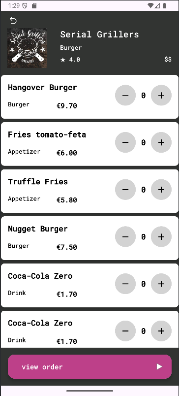

# 🍱 Tokki — Distributed Food Delivery App

**Tokki** is a trendy, minimalistic food delivery app designed and developed as part of the *Distributed Systems* course at the Athens University of Economics and Business.

The app was created with a modern UI and a backend architecture that embraces distributed computing principles. Tokki handles real-time communication between multiple system components and provides a seamless experience for users to order and receive food efficiently.

---

## 💡 Project Idea

The idea behind Tokki is simple: create a responsive, sleek, and reliable food delivery app that mimics real-world delivery workflows while showcasing core distributed systems concepts. We focused on:

- Multi-component communication (Master–Worker model)
- Fault tolerance and asynchronous messaging
- Responsiveness and performance on Android
- Realistic business flow simulation (order → confirmation → dispatch)

---

## 🛠️ Tech Stack

### Android Frontend
- **Android Studio** (Java + XML)
- Custom animations for UI transitions (e.g., slide up/down, order confirmation ticks)
- Clean MVVM-inspired architecture

### Backend
- **Java-based Distributed System**
- **Master/Worker Architecture**
- JSON-based message passing over TCP/HTTP
- Store/Product Management through worker nodes

---

## 🧠 Distributed Systems Concepts Applied

- **Master–Worker communication**: Master distributes tasks to workers and monitors their state
- **Message passing**: JSON payloads for structured inter-process communication
- **Basic consistency guarantees** during updates
- **Separation of concerns**: UI is fully decoupled from system logic

---

## 📲 Key Features

- View stores and browse meals
- Add to cart and checkout functionality
- Animated order confirmation with UI transitions
- Backend updates store/product data dynamically

---

## 📸 Screenshots

<p align="center">
  
  
  
  
</p>


---

## 🔧 How to Run

### Prerequisites

- Android Studio Arctic Fox or newer
- Java 11+
- Git
- macOS/Linux terminal (or WSL on Windows)

### Steps

```bash
# Clone the repository
git clone https://github.com/yourusername/tokki-app.git

# Open the Android project with Android Studio
# Then run backend manually:

cd backend/master
java MasterServer.java

cd ../worker
java WorkerNode.java
